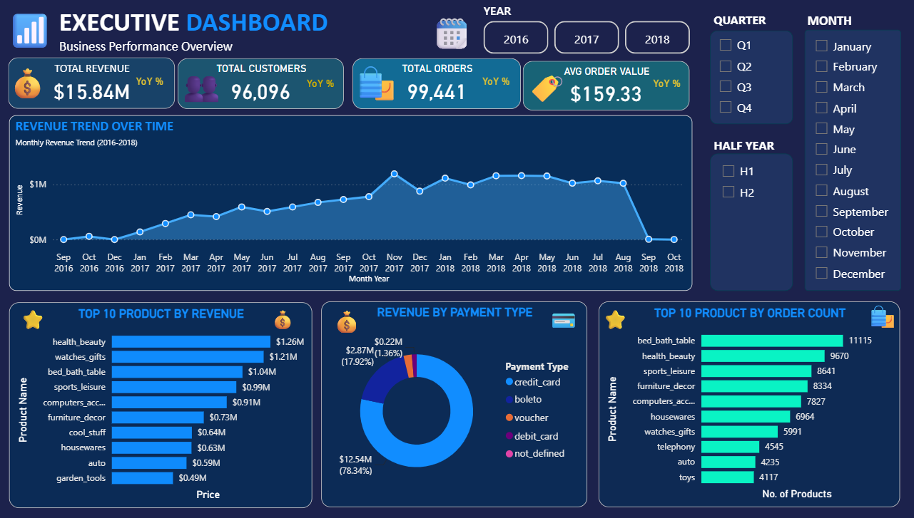
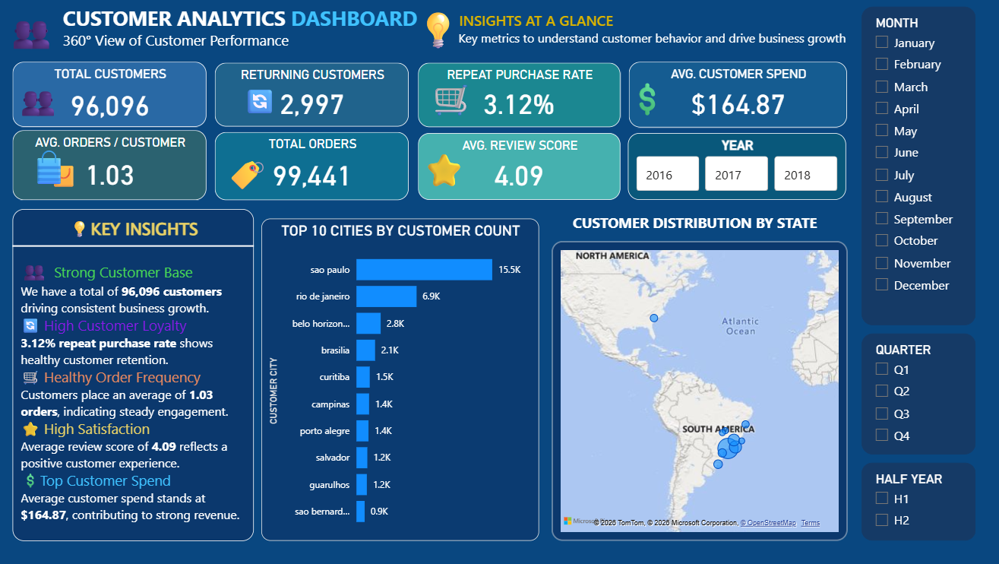
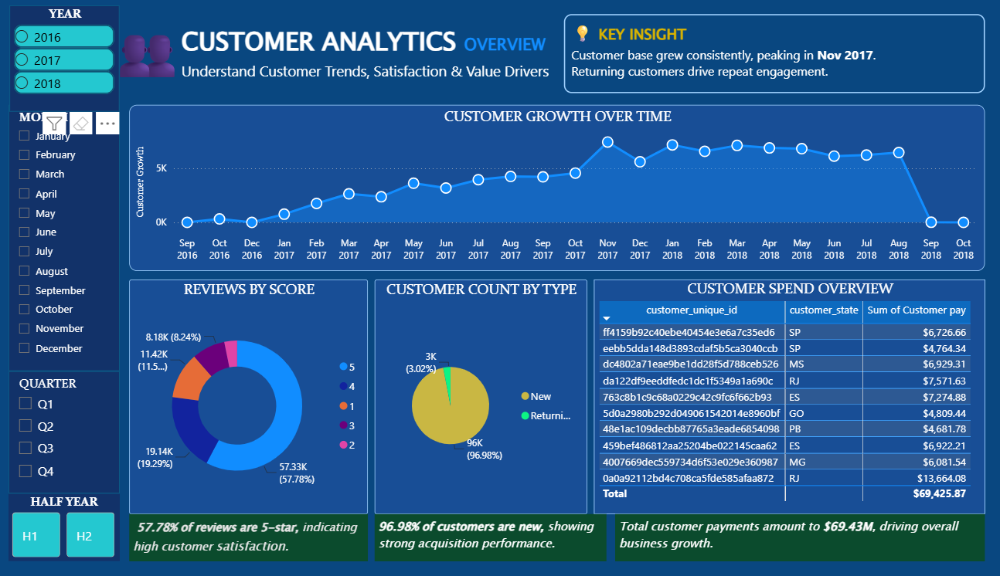
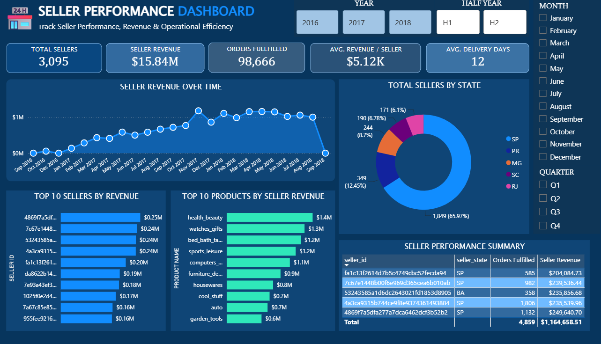
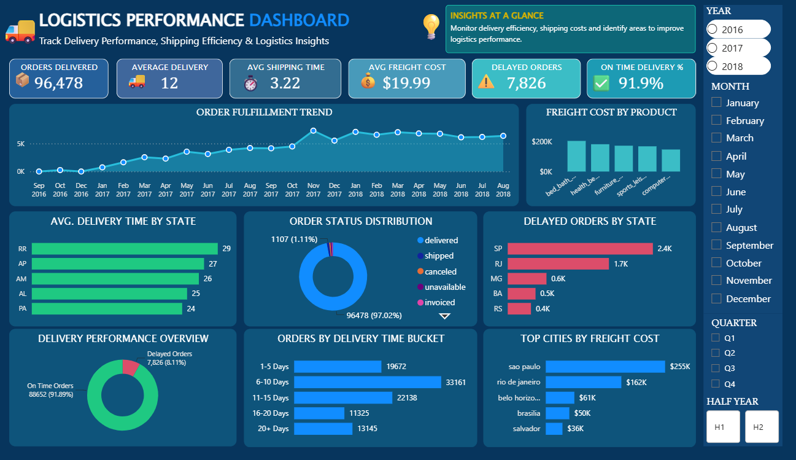
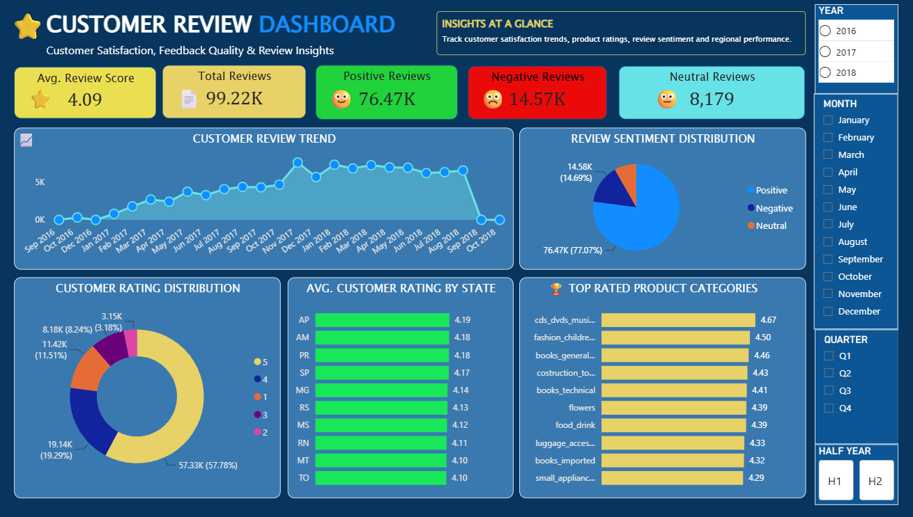

# 📊 Olist E-Commerce Analytics — Power BI Portfolio Project

> An end-to-end **Power BI Business Intelligence project** built on the Olist Brazilian E-Commerce Public Dataset — covering executive performance, customer behavior, seller performance, logistics efficiency, and customer reviews.


---

## 📑 Table of Contents

- [Project Overview](#-project-overview)
- [Business Objectives](#-business-objectives)
- [Dataset](#-dataset)
- [Data Model](#️-data-model)
- [Time Intelligence](#-time-intelligence)
- [Calculated Columns & Tables](#-calculated-columns--tables)
- [Dashboard 1 — Executive Dashboard](#-dashboard-1--executive-dashboard)
- [Dashboard 2 — Customer Analytics](#-dashboard-2--customer-analytics)
- [Dashboard 3 — Customer Analytics Overview](#-dashboard-3--customer-analytics-overview)
- [Dashboard 4 — Seller Performance](#️-dashboard-4--seller-performance)
- [Dashboard 5 — Logistics Performance](#-dashboard-5--logistics-performance)
- [Dashboard 6 — Customer Review](#-dashboard-6--customer-review)
- [KPI & DAX Framework](#-kpi--dax-framework)
- [Project Documentation](#-project-documentation)
- [Repository Structure](#️-recommended-github-structure)
- [Dashboard Design System](#-dashboard-design-system)
- [Tools & Technologies](#️-tools--technologies)
- [Analytical Skills Demonstrated](#-analytical-skills-demonstrated)
- [Key Portfolio Takeaways](#-key-portfolio-takeaways)
- [Future Enhancements](#-future-enhancements)
- [Author](#-author)
- [License](#-license)

---

## 🚀 Project Overview

This project converts raw Brazilian e-commerce transaction data into a **multi-page executive analytics solution**.

The final solution contains six analytical dashboard views:

| # | Dashboard | Focus |
|---|-----------|-------|
| 1 | 🏢 **Executive Dashboard** | Revenue, customers, orders, AOV and product/payment performance |
| 2 | 👥 **Customer Analytics Dashboard** | Customer base, loyalty, spend and geography |
| 3 | 📈 **Customer Analytics Overview** | Customer growth, reviews, customer type and payment/spend details |
| 4 | 🛍️ **Seller Performance Dashboard** | Seller revenue, fulfillment and seller distribution |
| 5 | 🚚 **Logistics Performance Dashboard** | Delivery speed, freight cost, delays and fulfillment |
| 6 | ⭐ **Customer Review Dashboard** | Review volume, sentiment, ratings and product-category satisfaction |

Every dashboard shares a consistent slicer panel for **Year, Month, Quarter, and Half Year**, and supports cross-filtering, KPI analysis, trend analysis, ranking, geographic analysis, and operational analysis.

---

## 🎯 Business Objectives

The project was designed to answer practical business questions:

**Revenue & Sales**
- How is revenue changing over time?
- Which products generate the most revenue?
- Which payment methods contribute the most revenue?
- What is the average order value?

**Customers**
- How large is the customer base, and how many customers return to purchase again?
- What is the repeat purchase rate and average customer spend?
- Which cities and states contain the largest customer populations?

**Sellers**
- Which sellers and products contribute the most revenue?
- Where are sellers geographically concentrated, and how many orders are fulfilled?

**Logistics**
- What percentage of orders are delivered on time?
- Which states experience the most delays, and which products/cities have higher freight costs?
- What are the most common delivery-time buckets?

**Customer Reviews**
- What is the average review score, and how are reviews distributed across sentiment?
- Which states and product categories receive the highest ratings?

---

## 🧩 Dataset

The project uses the **Olist Brazilian E-Commerce Public Dataset**.
https://www.kaggle.com/datasets/olistbr/brazilian-ecommerce

### Source tables

| Table | Main purpose |
|---|---|
| `olist_orders_dataset` | Order lifecycle, customer, purchase and delivery dates |
| `olist_order_items_dataset` | Product, seller, price and freight at order-item level |
| `olist_order_payments_dataset` | Payment type, installments and payment value |
| `olist_order_reviews_dataset` | Review scores, review dates and review text metadata |
| `olist_customers_dataset` | Customer identifiers and geographic attributes |
| `olist_products_dataset` | Product and category attributes |
| `olist_sellers_dataset` | Seller identifiers and geographic attributes |
| `olist_product_category_name_translation` | Product category translation |
| `olist_geolocation_dataset` | Geographic coordinates and location information |

### Key fields used across the project

`order_id` · `customer_id` · `customer_unique_id` · `order_status` · `order_purchase_timestamp` · `order_approved_at` · `order_delivered_carrier_date` · `order_delivered_customer_date` · `order_estimated_delivery_date` · `order_item_id` · `product_id` · `seller_id` · `price` · `freight_value` · `payment_type` · `payment_value` · `review_id` · `review_score` · `review_creation_date` · `customer_city` · `customer_state` · `seller_city` · `seller_state` · and product/category fields.

---

## 🏗️ Data Model

The Power BI model connects the transactional Olist tables through customer, order, product, seller, payment, review and geographic keys.

```text
Customers
    │
    └── customer_id
             │
             ▼
          Orders
       ┌─────┼─────┬──────────────┐
       │     │     │              │
       ▼     ▼     ▼              ▼
 Order     Order   Order       Customer
 Items    Payments Reviews      Analysis
   │
   ├── product_id ──► Products
   │
   └── seller_id ───► Sellers

Products ──► Product Category Translation
Geolocation ──► Geographic analysis
Calendar ──► Time intelligence
```

A dedicated **Calendar** table supports consistent time filtering and trend calculations. Additional support/calculation structures include `Calendar`, `Customer Orders`, and `Customer Type`.

> 📷 See `Screenshots/Data_Model.png` for the full Power BI model view.

---

## 📅 Time Intelligence

The dashboards use a common time framework: **Year** (2016–2018), **Month** (January–December), **Quarter** (Q1–Q4), and **Half Year** (H1–H2), each with dedicated sort columns so labels display in chronological rather than alphabetical order.

```dax
Year = YEAR('Calendar'[Date])
Month = FORMAT('Calendar'[Date], "MMMM")
Month No = MONTH('Calendar'[Date])
Quarter = "Q" & FORMAT('Calendar'[Date], "Q")

Half Year =
IF(MONTH('Calendar'[Date]) <= 6, "H1", "H2")

Half Year Sort =
IF(MONTH('Calendar'[Date]) <= 6, 1, 2)

Month Year = FORMAT('Calendar'[Date], "MMM YYYY")
```

---

## 🧮 Calculated Columns & Tables

**Calculated columns:** Order Date · Month Year · Delivery Days · Shipping Time · Delivery Delay Days · Delivery Bucket · Delivery Bucket Sort · Half Year · Half Year Sort · Review Category · Customer Type · Customer Pay

**Calculated/support tables:** Calendar · Customer Orders · Customer Type

The consolidated calculation reference contains **61 documented calculation entries** covering measures, calculated columns and calculated tables — see [`Olist_All_DAX_Measures_Columns_Tables.txt`](./Documentation/Olist_All_DAX_Measures_Columns_Tables.docx).

---

## 📊 Dashboard 1 — Executive Dashboard



**Purpose:** A management-level overview of revenue, customer volume, order volume and product/payment performance.

| KPI | Value |
|---|---|
| Total Revenue | **$15.84M** |
| Total Customers | **96,096** |
| Total Orders | **99,441** |
| Average Order Value | **$159.33** |

| Original concept | Professional title |
|---|---|
| Revenue trend | **Revenue Performance Trend** |
| Top products by revenue | **Top Revenue-Generating Products** |
| Revenue by payment type | **Revenue Contribution by Payment Method** |
| Top products by order count | **Top Products by Order Volume** |

**Key insight:** Revenue and order trends show the overall commercial trajectory; top-revenue products identify the strongest sales contributors; payment-method distribution reveals customer payment preferences; order-volume rankings identify products with strong demand frequency.

---

## 👥 Dashboard 2 — Customer Analytics



**Purpose:** A 360° view of customer acquisition, retention, spend, order frequency, satisfaction and geography.

| KPI | Value |
|---|---|
| Total Customers | **96,096** |
| Returning Customers | **2,997** |
| Repeat Purchase Rate | **3.12%** |
| Average Customer Spend | **$164.87** |
| Average Orders / Customer | **1.03** |
| Total Orders | **99,441** |
| Average Review Score | **4.09** |

| Analysis | Professional title |
|---|---|
| Customer growth | **Customer Acquisition & Growth Trend** |
| City ranking | **Top Customer Markets by City** |
| State map | **Geographic Distribution of Customer Base** |
| Customer type | **New vs Returning Customer Mix** |
| Customer review score | **Customer Rating Distribution** |
| Customer payments | **Customer Spend & Payment Overview** |

**Key insight:** The customer base is large, but the relatively small returning-customer share indicates that **retention and repeat-purchase programs can be a major growth opportunity**.

---

## 📈 Dashboard 3 — Customer Analytics Overview



**Purpose:** A more detailed customer-behavior view combining growth, review quality, customer type and payment details.

| Original visual | Professional title |
|---|---|
| Customer growth by month/year | **Customer Growth Over Time** |
| Reviews by score | **Review Score Distribution** |
| Customer count by type | **New vs Returning Customer Mix** |
| Customer payment table | **Customer Spend Overview** |

**Key insight:** The customer base is strongly acquisition-driven, while the returning-customer segment is comparatively small — making **customer retention, loyalty and repeat-order campaigns** important strategic opportunities.

---

## 🛍️ Dashboard 4 — Seller Performance



**Purpose:** Measures seller contribution, seller revenue, fulfillment and geographic distribution.

| KPI | Value |
|---|---|
| Total Sellers | **3,095** |
| Seller Revenue | **$15.84M** |
| Orders Fulfilled | **98,666** |
| Average Revenue / Seller | **$5.12K** |
| Average Delivery Days | **12** |

| Analysis | Professional title |
|---|---|
| Seller revenue trend | **Seller Revenue Performance Trend** |
| Seller state distribution | **Seller Distribution by State** |
| Top seller ranking | **Top Revenue-Contributing Sellers** |
| Product revenue | **Top Products Driving Seller Revenue** |
| Seller detail table | **Seller Performance Summary** |

**Key insight:** Seller performance is geographically concentrated, and a relatively small group of sellers/products accounts for substantial revenue — creating opportunities for **seller benchmarking, performance programs and operational support**.

---

## 🚚 Dashboard 5 — Logistics Performance



**Purpose:** Evaluates delivery efficiency, shipping speed, freight cost and delayed orders.

| KPI | Value |
|---|---|
| Orders Delivered | **96,478** |
| Average Delivery Days | **12** |
| Average Shipping Time | **3.22** |
| Average Freight Cost | **$19.99** |
| Delayed Orders | **7,826** |
| On-Time Delivery | **91.89%** |

| Analysis | Professional title |
|---|---|
| Orders delivered trend | **Order Fulfillment Trend** |
| Freight by product | **Freight Cost Contribution by Product** |
| Delivery time by state | **Average Delivery Time by State** |
| Order status | **Order Lifecycle Status Distribution** |
| Delayed orders by state | **Delayed Order Concentration by State** |
| On-time vs delayed | **On-Time vs Delayed Delivery Performance** |
| Delivery buckets | **Order Distribution by Delivery Time** |
| Freight by city | **Top Freight-Cost Markets by City** |

**Delivery buckets:** 1–5 Days · 6–10 Days · 11–15 Days · 16–20 Days · 20+ Days

**Key insight:** The dashboard shows strong overall on-time delivery performance, while delayed orders remain concentrated in specific states — supporting **regional logistics optimization and targeted carrier/fulfillment improvements**.

---

## ⭐ Dashboard 6 — Customer Review



**Purpose:** Analyzes customer satisfaction, review volume, sentiment, rating distribution and product-category performance.

| KPI | Value |
|---|---|
| Average Review Score | **4.09** |
| Total Reviews | **99.22K** |
| Positive Reviews | **76.47K** |
| Negative Reviews | **14.57K** |
| Neutral Reviews | **8,179** |

| Analysis | Professional title |
|---|---|
| Review trend | **Customer Review Volume Trend** |
| Sentiment | **Customer Sentiment Distribution** |
| Rating distribution | **Customer Rating Distribution** |
| Rating by state | **Average Customer Satisfaction by State** |
| Product-category rating | **Highest-Rated Product Categories** |

**Key insight:** The majority of reviews are positive and the average score is above 4, indicating generally strong customer satisfaction. The negative-review segment should still be monitored to identify recurring product, seller or delivery issues.

---

## 📌 KPI & DAX Framework

The project uses DAX across five major analytical areas.

<details>
<summary><strong>Sales & Executive</strong></summary>

Total Revenue · Total Orders · Total Customers · Average Order Value · Revenue YoY % · Revenue Previous Year · Order/Customer growth metrics
</details>

<details>
<summary><strong>Customer</strong></summary>

Returning Customers · Repeat Purchase Rate · Average Customer Spend · Average Orders per Customer · Customer Count · Customer Growth · Customer Type
</details>

<details>
<summary><strong>Seller</strong></summary>

Total Sellers · Seller Revenue · Orders Fulfilled · Average Revenue per Seller · Average Delivery Days
</details>

<details>
<summary><strong>Logistics</strong></summary>

Orders Delivered · Average Delivery Days · Average Shipping Time · Average Freight Cost · Delayed Orders · On-Time Delivery % · Delayed Order % · Delivery Bucket
</details>

<details>
<summary><strong>Reviews</strong></summary>

Total Reviews · Average Review Score · Positive/Negative/Neutral Reviews · Positive Review % · Negative Review % · Review Category · Average Rating by State · Average Rating by Product Category
</details>

---

## 📂 Project Documentation

To keep the repository professional and avoid unnecessary files, the project documentation is intentionally consolidated into **two main files**:

### 1. Master project documentation
`Documentation/Olist_PowerBI_Master_Project_Documentation.docx`

Contains the project overview, business objectives, dataset description, data preparation, data model, relationships, calculated columns/tables, DAX/measure documentation, KPI definitions, all six dashboard descriptions with professional chart titles and insights, screenshots, model screenshot, validation notes, limitations, and future scope.

### 2. Master DAX/calculation reference
`Documentation/Olist_All_DAX_Measures_Columns_Tables.txt`

Contains DAX measures, calculated columns, calculated tables, Calendar logic, delivery logic, customer logic, review logic, seller/logistics calculations, KPI mapping, and model/calculation notes.

> ℹ️ The original PBIX DAX export was not available in the supplied material. The TXT/DOCX calculation library is therefore a **reconstructed/reference implementation** based on the supplied dashboards, the visible model, and documented business logic — not a claim that every formula is an exact PBIX export.

---

## 🗂️ Recommended GitHub Structure

```text
Olist-PowerBI-Analytics/
│
├── README.md
│
├── PowerBI/
│   └── Olist_Ecommerce_Analytics.pbix
│
├── Documentation/
│   ├── Olist_PowerBI_Master_Project_Documentation.docx
│   └── Olist_All_DAX_Measures_Columns_Tables.txt
│
├── Screenshots/
│   ├── Executive_Dashboard.png
│   ├── Customer_Analytics.png
│   ├── Customer_Analytics_Overview.png
│   ├── Seller_Performance.png
│   ├── Logistics_Performance.png
│   ├── Customer_Review.png
│   └── Data_Model.png
│
└── Data/
    └── README.md
```

**Why this structure?** Documentation is deliberately kept to **one DOCX + one TXT** instead of splitting DAX, measures, model, KPIs and dashboard documentation into many separate files. Large/raw dataset files should generally not be committed to GitHub — provide dataset source/download instructions instead.

---

## 🎨 Dashboard Design System

The dashboard designs use a consistent executive visual language: dark navy/blue background, blue and cyan accents, high-contrast white typography, teal/green positive indicators, red/orange exception indicators, rounded KPI cards, a consistent slicer panel, professional chart titles, insight panels, icon/emoji visual cues, KPI-first hierarchy, and consistent spacing/alignment — suitable for both **portfolio presentation and business storytelling**.

---

## 🛠️ Tools & Technologies

Microsoft Power BI Desktop · DAX · Power Query · Data modeling · Time intelligence · KPI development · Interactive visualization · Geographic analysis · Ranking/Top-N analysis · Customer segmentation · Review sentiment classification · Operational performance analysis

---

## 📈 Analytical Skills Demonstrated

Data cleaning and transformation · Power Query ETL · Relational data modeling · Star-schema-oriented BI design · DAX measure development · Calculated columns and tables · Time intelligence · KPI design · Customer/Seller/Logistics/Review analytics · Geographic analysis · Trend analysis · Top-N ranking · Business insight generation · Executive dashboard design · Data storytelling

---

## 🔍 Key Portfolio Takeaways

```text
Raw Olist Data
      ↓
Power Query / Data Preparation
      ↓
Data Model + Calendar
      ↓
DAX Measures + Calculated Logic
      ↓
Executive KPIs
      ↓
┌─────────────────────────────────────────┐
│ Executive Performance                   │
│ Customer Analytics                      │
│ Seller Performance                      │
│ Logistics Performance                   │
│ Customer Review Analytics               │
└─────────────────────────────────────────┘
      ↓
Business Insights & Decisions
```

---

## 🚀 Future Enhancements

Customer lifetime value · Cohort retention analysis · RFM customer segmentation · Seller performance scoring · Delivery SLA monitoring · Profit/margin analysis · Automated anomaly detection · Advanced sentiment analysis using review text · Forecasting · Drill-through pages · Row-level security · Automated Power BI Service refresh · Executive alerting

> These are **future-scope items** and are not presented as completed project phases.

---

## 👤 Author
**Akanksha Singh** - https://www.linkedin.com/in/akanksha-singh-4715a0351/ © 2026

**Power BI / Data Analytics Portfolio Project**
An end-to-end Olist e-commerce Business Intelligence case study focused on transforming transactional data into actionable business insights.

**Power BI + DAX + Power Query + Data Modeling + KPI Design + Business Intelligence + Data Storytelling**

---

## 📄 License

This project is released under the [MIT License](./LICENSE). The Olist dataset is publicly available and remains subject to its own original license terms on [Kaggle](https://www.kaggle.com/datasets/olistbr/brazilian-ecommerce).

---

⭐ If you found this project useful, consider giving it a star on GitHub!
